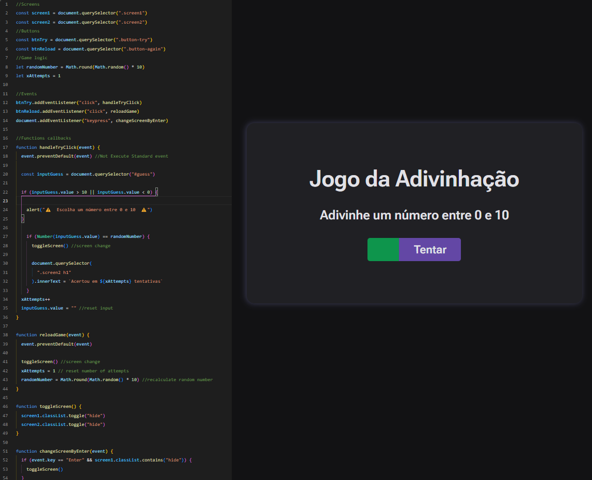

<h1 align="center"> Stage 5 - Avançando no JavaScript - Jogo de Adivinhação 💜 </h1>

  <a href="#-tecnologias">Tecnologias</a>&nbsp;&nbsp;&nbsp;|&nbsp;&nbsp;&nbsp;
  <a href="#-projeto">Projeto</a>&nbsp;&nbsp;&nbsp;|&nbsp;&nbsp;&nbsp;
  <a href="#memo-licença">Licença</a>

 

  

## 🚀 Tecnologias

Esse projeto foi desenvolvido com as seguintes tecnologias:

- HTML e CSS
- Java Script
- Git e Github
- Figma

## 💻 Projeto

Nesse projeto foi recriado um jogo de adivinhação com intuito didático para praticar habilidades de lógica de programação, programação em JS e introduzir aos conhecimentos básicos e manipulação da DOM. Alguns desafios de melhoria do jogo foram feitos, como validações, mensagens de incentivo ao jogador e alertas, espero que aproveite e se divirta!

## :memo: Licença

Esse projeto está sob a licença MIT.

---

Feito com  ♥  by Alex Lima

Você pode acessar o Website do projeto através do link: 
<a href= "https://alima07.github.io/rocketseat-stage5-jogo-adivinhacao/" target="_blank"> Clique aqui ⏯ </a>

